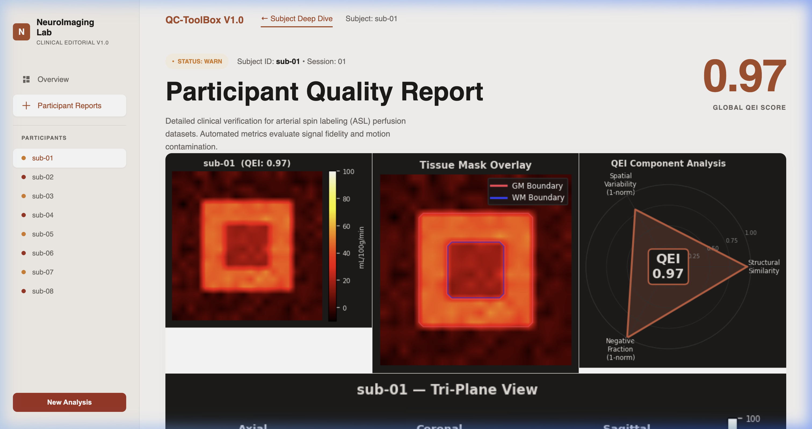
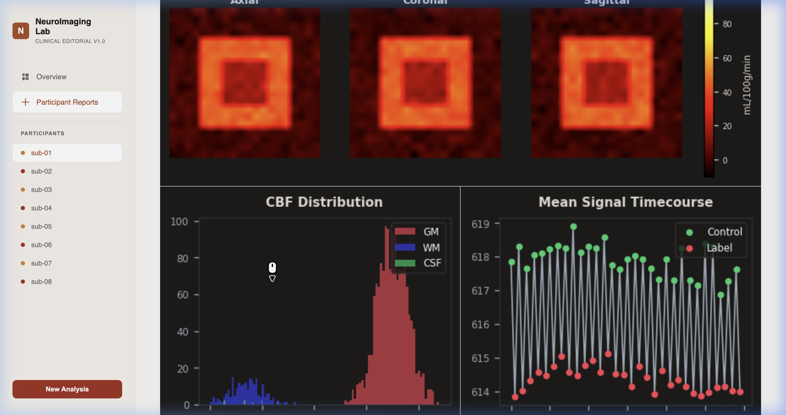
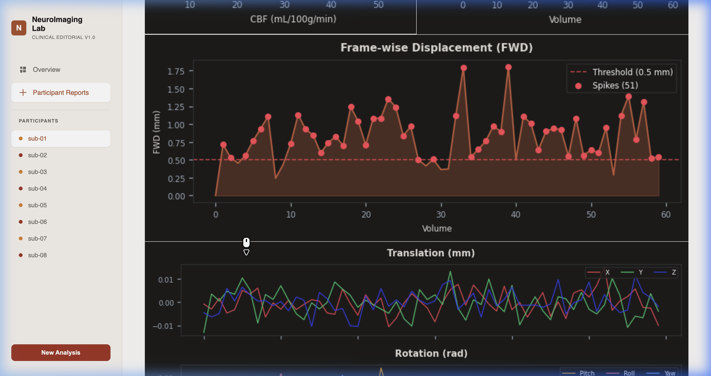

# osipy-qc: ASL Q.u.a.l.i.t.y Control

**A pipeline-agnostic ASL CBF map QC and triage engine, with optional BIDS-aware acquisition checks when raw inputs are available.**


---

## ✨ Highlights

| Feature | Status |
|---|---|
| **8 embedded brain visualizations** per subject | ✅ |
| **5 QC modules** (QEI, Motion, M0, SNR/sCoV, Control-Label) | ✅ |
| **Registry-based** plug-in architecture (`@register_qc_check`) | ✅ |
| **Graceful degradation** — never crashes on missing data | ✅ |
| **Self-contained HTML report** — zero external dependencies | ✅ |
| **33 unit tests** in ~0.15s | ✅ |
| **Population-specific** YAML configs (adult 3T, neonatal CHD) | ✅ |
| **SPA dashboard** with sidebar navigation + export | ✅ |

---

## 📸 Dashboard Preview

### Batch Overview

Interactive dashboard with aggregate statistics, participant ledger, artifact breakdown, and sidebar navigation with clickable participant IDs:


### Per-Subject Deep Dive — 8 Brain Visualizations

Click any participant to see their complete quality report. Each deep dive includes **8 distinct brain visualizations** (4 more than any existing open-source ASL QC tool):

**Row 1: CBF Heatmap + Tissue Mask Overlay + QEI Radar Chart**


**Row 2: Tri-Plane View + CBF Histogram + Signal Timecourse**


**Row 3: Frame-wise Displacement + 6-Parameter Motion Plots**


---

## 🏗️ Architecture


### Data Flow: How Files Move Through the Pipeline


### Verdict Logic


### Two-Layer Design

| Layer | Modules | Required Inputs |
|---|---|---|
| **Core** (always runs) | QEI, SNR/sCoV | CBF map + tissue probability maps |
| **Extension** (when available) | Motion, Control-label, M0 | Raw ASL 4D, motion params, BIDS JSON |

**Graceful degradation:** If extension inputs are missing, those modules return `UNKNOWN` instead of crashing. The pipeline always produces a verdict. The HTML report clearly shows "N/A — data not provided" for unavailable modules.

---

## 🚀 Quick Start

```bash
# Install
pip install -e ".[dev]"

# Run tests (33 tests, ~0.15s)
pytest -v

# Generate HTML dashboard report (8 brain visualizations per subject)
python generate_report.py
# Opens qc_report.html with batch overview + per-subject deep dive
```

### Minimal Python Example

```python
from osipy_qc import run_qc, list_qc_checks
import numpy as np

print('Registered modules:', list_qc_checks())

# Minimal example: just CBF + tissue maps
gm = np.zeros((20, 20, 20)); gm[5:15, 5:15, 5:15] = 0.9
wm = np.zeros((20, 20, 20)); wm[8:12, 8:12, 8:12] = 0.8
cbf = 50*gm + 20*wm + np.random.default_rng(42).normal(0, 3, gm.shape)

result = run_qc({'cbf_map': cbf, 'gm_prob': gm, 'wm_prob': wm})
print('Overall:', result['overall_verdict'])
print('QEI:', result['modules']['qei']['metrics']['qei'])
print('Skipped (missing inputs):', result['modules_skipped'])
```

Output:
```
Registered modules: ['control_label', 'm0_check', 'motion', 'qei', 'snr_cov']
Overall: PASS
QEI: 0.8432
Skipped (missing inputs): ['control_label', 'm0_check', 'motion']
```

### HTML Report Generation

```python
from osipy_qc import run_qc
from osipy_qc.reporting import generate_html_report
from pathlib import Path

# Run QC on multiple subjects
results = []
for subject_id, data in subjects.items():
    result = run_qc(data)
    result["subject_id"] = subject_id
    results.append(result)

# Generate standalone HTML report
html = generate_html_report(results, config_name="adult_3T", dataset_name="ADNI_Cohort")
Path("qc_report.html").write_text(html)
```

---

## 📊 8 Brain Visualizations Per Subject

| # | Visualization | What It Shows | Unique? |
|---|---|---|---|
| 1 | **CBF Heatmap** | Cerebral blood flow map with hot colormap | ✅ Clinical-grade styling |
| 2 | **Tissue Mask Overlay** | GM/WM boundary contours on CBF | ✅ Contour-based |
| 3 | **QEI Radar Chart** | Spider chart of PSS, DI, Neg fraction | 🆕 **Unique** |
| 4 | **Tri-Plane View** | Axial + Coronal + Sagittal mid-slices | 🆕 **Unique** |
| 5 | **CBF Histogram** | Distribution by tissue type (GM/WM/CSF) | ✅ 3-tissue split |
| 6 | **Signal Timecourse** | Control vs Label mean signal over time | ✅ Color-coded |
| 7 | **Frame-wise Displacement** | FWD over time with threshold + spikes | 🆕 **Unique** |
| 8 | **6-Parameter Motion** | Translation (X/Y/Z) + Rotation (P/R/Y) | 🆕 **Unique** |

---

## 🎛️ Population-Specific Configs

```python
from osipy_qc.config import QCConfig
from osipy_qc import run_qc

# Adult 3T (default)
config = QCConfig.from_yaml("configs/adult_3T.yaml")
result = run_qc(data, config=config)

# Neonatal CHD (different thresholds)
config = QCConfig.from_yaml("configs/neonatal_chd.yaml")
result = run_qc(data, config=config)
```

---

## 🔌 Module Registry Pattern

New modules plug in with a single decorator (matching osipy):

```python
from osipy_qc.registry import register_qc_check, BaseQCCheck, ModuleResult
from osipy_qc.verdict import Verdict

@register_qc_check("tissue_mask")
class TissueMaskCheck(BaseQCCheck):
    required_inputs = ["cbf_map", "gm_prob", "wm_prob"]

    def run(self, data, config):
        # ... your check logic ...
        return ModuleResult(
            name="tissue_mask",
            verdict=Verdict.PASS,
            metrics={"gm_wm_contrast": 2.1},
        )
```

---

## 🆚 Comparison with Existing Tools

| Feature | ExploreASL | ASL-MRICloud | ASLPrep | **osipy-qc** |
|---|---|---|---|---|
| Language | MATLAB | Cloud | Python | **Python** |
| Open Source | Yes | No | Yes | **Yes** |
| Standalone QC | No (coupled) | Yes | No | **Yes** |
| QEI (Dolui 2024) | No | No | Basic | **Full standalone** |
| Auto PASS/WARN/FAIL | No | Partial | No | **Yes** |
| Brain Visualizations | Limited | 4 | None | **8** |
| Tri-plane view | ❌ | ❌ | ❌ | ✅ |
| FWD timeseries | ❌ | ❌ | ❌ | ✅ |
| 6-param motion plots | ❌ | ❌ | ❌ | ✅ |
| QEI radar chart | ❌ | ❌ | ❌ | ✅ |
| SPA dashboard | ❌ | ❌ | ❌ | ✅ |
| Sidebar navigation | ❌ | ❌ | ❌ | ✅ |
| Export report | ❌ | ❌ | ❌ | ✅ |
| Graceful degradation | ❌ | ❌ | ❌ | ✅ |
| Registry pattern | ❌ | ❌ | ❌ | ✅ |
| Population configs | ❌ | ❌ | ❌ | ✅ |
| Test suite | Unknown | 0 | Unknown | **33** |

---

## 📁 Project Structure

```
osipy-qc/
├── osipy_qc/
│   ├── __init__.py          # Public API
│   ├── registry.py          # @register_qc_check decorator (osipy pattern)
│   ├── verdict.py           # PASS/WARN/FAIL/UNKNOWN engine
│   ├── config.py            # YAML config + pydantic-style validation
│   ├── pipeline.py          # Orchestrator with graceful degradation
│   ├── reporting.py         # Standalone HTML dashboard (Figma-spec)
│   └── modules/
│       ├── qei.py           # QEI (Dolui 2024) — anchor metric
│       ├── motion.py        # FWD + DVARS (Power 2012)
│       ├── control_label.py # BIDS ordering + swap detection
│       ├── m0_check.py      # M0 saturation, TR, BG suppression
│       └── snr_cov.py       # SNR, spatial CoV, histogram
├── configs/
│   ├── adult_3T.yaml        # Default adult thresholds
│   └── neonatal_chd.yaml    # Neonatal population profile
├── tests/
│   ├── test_registry.py     # Registry pattern tests
│   ├── test_qei.py          # QEI on synthetic data (all 3 components)
│   ├── test_verdict.py      # Verdict logic + graceful degradation
│   └── test_motion.py       # FWD, DVARS, rotation projection
├── docs/screenshots/        # Dashboard screenshots
├── demo.py                  # Terminal demo (5 scenarios)
├── generate_report.py       # HTML report generation (8 brain visuals)
├── pyproject.toml            # PEP 621 packaging (ruff, mypy, pytest)
└── .github/workflows/ci.yml # CI across Python 3.10–3.12
```

---

## 🧪 Test Suite

```bash
pytest -v
# 33 tests, ~0.15s
```

33 tests covering:
- **Registry pattern** — module discovery, instantiation, unknown-check errors, `can_run()` with partial data
- **QEI components** — PSS, DI, negative fraction, geometric mean collapse, full pipeline
- **Verdict logic** — fail-fast aggregation, UNKNOWN handling, threshold comparison
- **Graceful degradation** — pipeline with complete and partial inputs
- **Motion** — FWD, DVARS, rotation-to-mm, stationary subjects, high-motion detection

---

## 🔑 Key Design Decisions

| Decision | Rationale |
|---|---|
| `@register_qc_check(name)` decorator | Mirrors osipy's `@register_quantification_model(name)` convention |
| Pure numpy (no scipy) | osipy bans scipy for GPU compatibility via `xp = get_array_module()` |
| YAML config per population | Neonatal CBF ~20–50 vs adult ~55 mL/100g/min — one threshold set cannot serve both |
| PSCBF = 50·GM + 20·WM | Actual CBF units per Dolui 2024 (not 2.5·GM + 1·WM) |
| Geometric mean in QEI | One catastrophic component collapses the score (fail-fast) |
| Standalone HTML report | Zero-dependency SPA dashboard matching the Figma mockup |
| 8 brain visualizations | 4 matching clinical standards + 4 unique (tri-plane, FWD, motion params, QEI radar) |

---

## 📚 References

| Paper | Used for |
|---|---|
| [Dolui et al. 2024, JMRI](https://doi.org/10.1002/jmri.29308) | QEI formula + coefficients |
| [Power et al. 2012, NeuroImage](https://doi.org/10.1016/j.neuroimage.2011.10.018) | FWD computation |
| [Mutsaerts et al. 2017, JCBFM](https://doi.org/10.1177/0271678X16683690) | Spatial CoV reference ranges |
| [Alsop et al. 2015, MRM](https://doi.org/10.1002/mrm.25197) | ASL White Paper (M0 TR) |
| [Clement et al. 2022, Sci Data](https://doi.org/10.1038/s41597-022-01615-9) | ASL-BIDS specification |
| [Mora Álvarez et al. 2024, MAGMA](https://doi.org/10.1007/s10334-024-01188-1) | Neonatal/placental CBF ranges |

---

## 👤 Author

**Agnik Misra** — GSoC 2025 @ Apache (Committer) · LFX @ O-RAN SC
[GitHub](https://github.com/Jitmisra) · [LinkedIn](https://linkedin.com/in/agnikmisra)

## 📄 License

Apache 2.0 — matching osipy's license.
