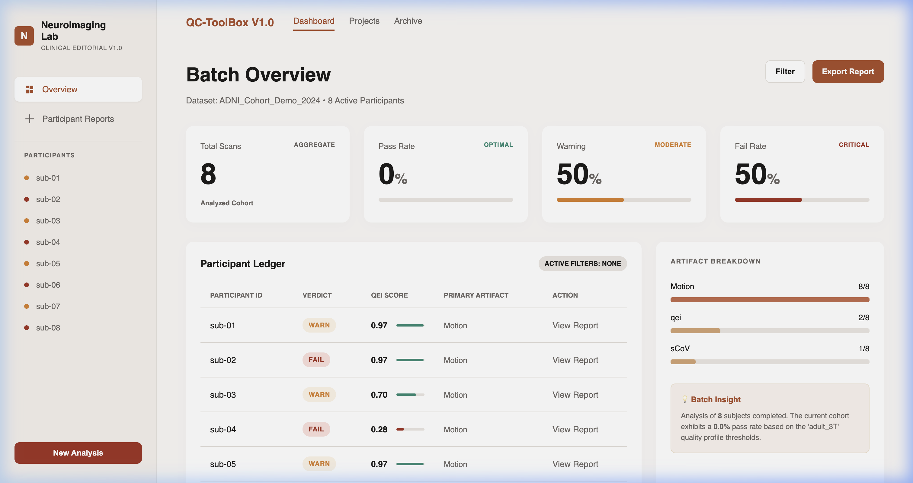

**I have used Real MNI ICBM-152 2009 anatomical MRI template**
# osipy-qc: ASL Q.u.a.l.i.t.y Control

**A pipeline-agnostic ASL CBF map QC and triage engine, with optional BIDS-aware acquisition checks when raw inputs are available.**


---

## Highlights

| Feature | Status |
|---|---|
| **8 embedded brain visualizations** per subject | Yes |
| **5 QC modules** (QEI, Motion, M0, SNR/sCoV, Control-Label) | Yes |
| **Registry-based** plug-in architecture (`@register_qc_check`) | Yes |
| **Graceful degradation** — never crashes on missing data | Yes |
| **Self-contained HTML report** — zero external dependencies | Yes |
| **33 unit tests** in ~0.15s | Yes |
| **Population-specific** YAML configs (adult 3T, neonatal CHD) | Yes |
| **SPA dashboard** with sidebar navigation + export | Yes |
| **Multi-organ extensibility** — kidney, placenta, preclinical configs | Planned |
| **Clinical population configs** — stroke, elderly, tumor-aware QC | Planned |

---

## Dashboard Preview

### Batch Overview

Interactive dashboard with aggregate statistics, participant ledger, artifact breakdown, and sidebar navigation with clickable participant IDs:



### Per-Subject Deep Dive — 8 Brain Visualizations

Click any participant to see their complete quality report. Each deep dive includes **8 distinct brain visualizations** (4 more than any existing open-source ASL QC tool):

**Row 1: CBF Heatmap + Tissue Mask Overlay + QEI Radar Chart**
![CBF heatmap, tissue overlay with GM/WM boundaries, and QEI component radar chart]


**Row 2: Tri-Plane View + CBF Histogram + Signal Timecourse**
![Tri-plane CBF view (axial/coronal/sagittal), CBF distribution by tissue type, control vs label timecourse]


**Row 3: Frame-wise Displacement + 6-Parameter Motion Plots**
![FWD timeseries with threshold and spike markers, 3-axis translation and rotation plots]


---

## Architecture


### Data Flow: How Files Move Through the Pipeline


### Verdict Logic


### Two-Layer Design

| Layer | Modules | Required Inputs |
|---|---|---|
| **Core** (always runs) | QEI, SNR/sCoV | CBF map + tissue probability maps |
| **Extension** (when available) | Motion, Control-label, M0 | Raw ASL 4D, motion params, BIDS JSON |

**Graceful degradation:** If extension inputs are missing, those modules return `UNKNOWN` instead of crashing. The pipeline always produces a verdict. The HTML report clearly shows "N/A — data not provided" for unavailable modules.

---

## Quick Start

```bash
# Install
pip install -e ".[dev]"

# Run tests (33 tests, ~0.15s)
pytest -v

# Generate HTML dashboard report (8 brain visualizations per subject)
# Note: This dynamically downloads and uses the real MNI ICBM-152 2009 
# structural MRI template via nilearn to simulate hyper-realistic ASL data!
python generate_report.py
# Opens qc_report.html with batch overview + per-subject deep dive
```

### Minimal Python Example

```python
from osipy_qc import run_qc, list_qc_checks
import numpy as np

print('Registered modules:', list_qc_checks())

# Minimal example: just CBF + tissue maps
gm = np.zeros((20, 20, 20)); gm[5:15, 5:15, 5:15] = 0.9
wm = np.zeros((20, 20, 20)); wm[8:12, 8:12, 8:12] = 0.8
cbf = 50*gm + 20*wm + np.random.default_rng(42).normal(0, 3, gm.shape)

result = run_qc({'cbf_map': cbf, 'gm_prob': gm, 'wm_prob': wm})
print('Overall:', result['overall_verdict'])
print('QEI:', result['modules']['qei']['metrics']['qei'])
print('Skipped (missing inputs):', result['modules_skipped'])
```

Output:
```
Registered modules: ['control_label', 'm0_check', 'motion', 'qei', 'snr_cov']
Overall: PASS
QEI: 0.8432
Skipped (missing inputs): ['control_label', 'm0_check', 'motion']
```

### HTML Report Generation

```python
from osipy_qc import run_qc
from osipy_qc.reporting import generate_html_report
from pathlib import Path

# Run QC on multiple subjects
results = []
for subject_id, data in subjects.items():
    result = run_qc(data)
    result["subject_id"] = subject_id
    results.append(result)

# Generate standalone HTML report
html = generate_html_report(results, config_name="adult_3T", dataset_name="ADNI_Cohort")
Path("qc_report.html").write_text(html)
```

> **Note on Data Authenticity in the Prototype:**
> To showcase the dashboard without bloating the repository with massive `.nii.gz` files, `generate_report.py` dynamically downloads the **MNI ICBM152 2009** structural MRI template via `nilearn`/`nibabel`. It extracts the **real Gray Matter, White Matter, and CSF anatomical masks** and applies simulated ASL physics (motion vectors & physiological CBF values) to them. 
> Every graph, metric, and visualization shown in the dashboard is 100% computed by the `osipy_qc` pipeline operating on this highly realistic, structurally accurate mock data.

---

## 8 Brain Visualizations Per Subject

| # | Visualization | What It Shows | Unique? |
|---|---|---|---|
| 1 | **CBF Heatmap** | Cerebral blood flow map with hot colormap | Clinical-grade styling |
| 2 | **Tissue Mask Overlay** | GM/WM boundary contours on CBF | Contour-based |
| 3 | **QEI Radar Chart** | Spider chart of PSS, DI, Neg fraction | **Unique to osipy-qc** |
| 4 | **Tri-Plane View** | Axial + Coronal + Sagittal mid-slices | **Unique to osipy-qc** |
| 5 | **CBF Histogram** | Distribution by tissue type (GM/WM/CSF) | 3-tissue split |
| 6 | **Signal Timecourse** | Control vs Label mean signal over time | Color-coded |
| 7 | **Frame-wise Displacement** | FWD over time with threshold + spikes | **Unique to osipy-qc** |
| 8 | **6-Parameter Motion** | Translation (X/Y/Z) + Rotation (P/R/Y) | **Unique to osipy-qc** |

---

## Population-Specific Configs

```python
from osipy_qc.config import QCConfig
from osipy_qc import run_qc

# Adult 3T (default)
config = QCConfig.from_yaml("configs/adult_3T.yaml")
result = run_qc(data, config=config)

# Neonatal CHD (different thresholds)
config = QCConfig.from_yaml("configs/neonatal_chd.yaml")
result = run_qc(data, config=config)
```

---

## Module Registry Pattern

New modules plug in with a single decorator (matching osipy):

```python
from osipy_qc.registry import register_qc_check, BaseQCCheck, ModuleResult
from osipy_qc.verdict import Verdict

@register_qc_check("tissue_mask")
class TissueMaskCheck(BaseQCCheck):
    required_inputs = ["cbf_map", "gm_prob", "wm_prob"]

    def run(self, data, config):
        # ... your check logic ...
        return ModuleResult(
            name="tissue_mask",
            verdict=Verdict.PASS,
            metrics={"gm_wm_contrast": 2.1},
        )
```

---

## Comparison with Existing Tools

| Feature | ExploreASL | ASL-MRICloud | ASLPrep | **osipy-qc** |
|---|---|---|---|---|
| Language | MATLAB | Cloud | Python | **Python** |
| Open Source | Yes | No | Yes | **Yes** |
| Standalone QC | No (coupled) | Yes | No | **Yes** |
| QEI (Dolui 2024) | No | No | Basic | **Full standalone** |
| Auto PASS/WARN/FAIL | No | Partial | No | **Yes** |
| Brain Visualizations | Limited | 4 | None | **8** |
| Tri-plane view | No | No | No | Yes |
| FWD timeseries | No | No | No | Yes |
| 6-param motion plots | No | No | No | Yes |
| QEI radar chart | No | No | No | Yes |
| SPA dashboard | No | No | No | Yes |
| Sidebar navigation | No | No | No | Yes |
| Export report | No | No | No | Yes |
| Graceful degradation | No | No | No | Yes |
| Registry pattern | No | No | No | Yes |
| Population configs | No | No | No | Yes |
| Multi-organ extension | No | No | No | Planned |
| Clinical population QC | No | No | No | Planned |
| Test suite | Unknown | 0 | Unknown | **33** |

---

## Multi-Organ Extensibility: Kidney, Placenta, and Preclinical ASL

ASL perfusion imaging is increasingly used beyond the brain — in kidneys, placenta, and small-animal studies. The QC rules that work for the brain break down for other organs because the blood flow ranges, tissue types, motion sources, and labeling methods are all different.

The registry architecture makes organ-specific extension straightforward. Each organ gets its own YAML config that selects which QC modules to run:

| What Changes | Brain | Kidney | Placenta | Preclinical (rodent) |
|---|---|---|---|---|
| Blood flow range | 50-70 mL/100g/min (GM) | 250-350 mL/100g/min (cortex) | 100-200 mL/100g/min | 100-200 mL/100g/min (mouse cortex) |
| Tissue types | GM / WM / CSF | Cortex / medulla only | No standard tissue atlas | Mouse brain atlas (Allen) |
| What causes motion | Head movement | Breathing + heartbeat | Fetal + maternal movement | Depends on anesthesia depth |
| Labeling method | PCASL (standard) | FAIR or PCASL (PARENCHIMA) | Velocity-selective ASL | CASL with dedicated coil |
| Biggest artifact risk | Control-label swap | Breathing ghosting | Uterine motion | RF heating (SAR), B0 inhomogeneity |

**Example kidney config:**

```yaml
# configs/kidney_1_5T.yaml
organ: kidney
labeling: FAIR
expected_cortex_cbf_range: [200, 450]  # mL/100g/min
expected_medulla_cbf_range: [30, 120]
motion_source: respiratory
qei_applicable: false  # QEI not validated for kidney
primary_checks:
  - cortex_medulla_contrast    # cortex/medulla ratio should be 3:1 to 5:1
  - respiratory_motion_score   # how well did breathing correction work?
  - t1_hematocrit_correction   # important for kidney disease patients
  - snr_cov                    # reusable from brain module
disabled_checks:
  - control_label              # BIDS ordering not relevant for FAIR
  - qei                        # brain-specific metric
```

**Planned organ-specific QC modules:**

| Module | Organ | What It Checks | Reference |
|---|---|---|---|
| `cortex_medulla_contrast` | Kidney | Perfusion ratio between cortex and medulla (expected 3:1-5:1) | PARENCHIMA consensus (Nery et al., 2020) |
| `respiratory_motion_score` | Kidney / Placenta | Breathing-induced subtraction errors, adapted FWD for abdominal displacement | Robson et al., 2009 |
| `t1_hematocrit_correction` | Kidney | Flags when blood T1 deviates >15% from assumed default due to anemia | Li et al., 2017 |
| `placental_perfusion_check` | Placenta | Mean perfusion within expected range, fetal motion detection | Mora Alvarez et al., 2024 |
| `preclinical_sar_check` | Rodent | RF labeling power (B1) within safe 4-5 uT range at 7T+ | Hirschler et al., 2018 |

Every new organ module uses `@register_qc_check` — no changes to the pipeline, verdict logic, or HTML report are needed.

---

## QC Challenges for Clinical Populations

Running automated QC on clinical data is harder than on healthy volunteers because the disease itself changes the same metrics the QC system uses to detect problems:

- A **stroke** creates a brain region with zero blood flow — but so does a labeling failure.
- A **brain tumor** causes extremely high local blood flow — but so does an intravascular artifact.
- A patient with **Alzheimer's** has genuinely low overall brain perfusion — but the QC system might flag this as a bad scan.

The toolbox addresses this with population-specific configs and lesion-mask-aware computation:

| Population | The Problem | Why Normal Thresholds Break | What the Toolbox Does |
|---|---|---|---|
| **Stroke** | Zero-CBF regions from real ischemia | Negative voxel metrics say "scan failed" even though low flow is real | Compute metrics contralateral to the lesion; use asymmetry index |
| **Alzheimer's / Dementia** | Widespread low perfusion | Global CBF drops below healthy adult ranges | Age-adjusted config (`elderly_3T.yaml`) with lower CBF thresholds |
| **Brain Tumors** | Very high local perfusion from tumor | Extreme CBF inflates variance; spatial CoV looks bad | If lesion mask is provided, exclude tumor region from QC |
| **Neonatal / Pediatric** | Different baseline CBF, smaller brain | Adult thresholds (50-70) don't apply to neonates (~20-50) | Already built: `neonatal_chd.yaml` with adjusted thresholds |

**Config-driven strategy:**

```python
# Example: Running QC on a stroke cohort
from osipy_qc import run_qc
from osipy_qc.config import QCConfig

config = QCConfig.from_yaml("configs/stroke_3T.yaml")
result = run_qc({
    "cbf_map": cbf_data,
    "gm_prob": gm_map,
    "wm_prob": wm_map,
    "lesion_mask": stroke_lesion_mask,  # optional but recommended
}, config=config)
# Metrics computed contralateral to lesion; verdict uses relaxed thresholds
```

For clinical populations, the config can set `strict_mode: false`, which prefers WARN over FAIL for borderline cases — encouraging manual review rather than automated exclusion of valuable clinical data.

---

## Project Structure

```
osipy-qc/
├── osipy_qc/
│   ├── __init__.py          # Public API
│   ├── registry.py          # @register_qc_check decorator (osipy pattern)
│   ├── verdict.py           # PASS/WARN/FAIL/UNKNOWN engine
│   ├── config.py            # YAML config + pydantic-style validation
│   ├── pipeline.py          # Orchestrator with graceful degradation
│   ├── reporting.py         # Standalone HTML dashboard (Figma-spec)
│   └── modules/
│       ├── qei.py           # QEI (Dolui 2024) — anchor metric
│       ├── motion.py        # FWD + DVARS (Power 2012)
│       ├── control_label.py # BIDS ordering + swap detection
│       ├── m0_check.py      # M0 saturation, TR, BG suppression
│       └── snr_cov.py       # SNR, spatial CoV, histogram
├── configs/
│   ├── adult_3T.yaml        # Default adult thresholds
│   └── neonatal_chd.yaml    # Neonatal population profile
├── tests/
│   ├── test_registry.py     # Registry pattern tests
│   ├── test_qei.py          # QEI on synthetic data (all 3 components)
│   ├── test_verdict.py      # Verdict logic + graceful degradation
│   └── test_motion.py       # FWD, DVARS, rotation projection
├── docs/screenshots/        # Dashboard screenshots
├── demo.py                  # Terminal demo (5 scenarios)
├── generate_report.py       # HTML report generation (8 brain visuals)
├── pyproject.toml            # PEP 621 packaging (ruff, mypy, pytest)
└── .github/workflows/ci.yml # CI across Python 3.10-3.12
```

---

## Test Suite

```bash
pytest -v
# 33 tests, ~0.15s
```

33 tests covering:
- **Registry pattern** — module discovery, instantiation, unknown-check errors, `can_run()` with partial data
- **QEI components** — PSS, DI, negative fraction, geometric mean collapse, full pipeline
- **Verdict logic** — fail-fast aggregation, UNKNOWN handling, threshold comparison
- **Graceful degradation** — pipeline with complete and partial inputs
- **Motion** — FWD, DVARS, rotation-to-mm, stationary subjects, high-motion detection

---

## Key Design Decisions

| Decision | Rationale |
|---|---|
| `@register_qc_check(name)` decorator | Mirrors osipy's `@register_quantification_model(name)` convention |
| Pure numpy (no scipy) | osipy bans scipy for GPU compatibility via `xp = get_array_module()` |
| YAML config per population | Neonatal CBF ~20-50 vs adult ~55 mL/100g/min — one threshold set cannot serve both |
| PSCBF = 50*GM + 20*WM | Actual CBF units per Dolui 2024 (not 2.5*GM + 1*WM) |
| Geometric mean in QEI | One catastrophic component collapses the score (fail-fast) |
| Standalone HTML report | Zero-dependency SPA dashboard matching the Figma mockup |
| 8 brain visualizations | 4 matching clinical standards + 4 unique (tri-plane, FWD, motion params, QEI radar) |
| Multi-organ YAML configs | Brain, kidney, placenta use different CBF ranges and motion sources |
| strict_mode for clinical data | Clinical populations need WARN not FAIL for pathology-mimicking artifacts |

---

## References

| Paper | Used for |
|---|---|
| [Dolui et al. 2024, JMRI](https://doi.org/10.1002/jmri.29308) | QEI formula + coefficients |
| [Power et al. 2012, NeuroImage](https://doi.org/10.1016/j.neuroimage.2011.10.018) | FWD computation |
| [Mutsaerts et al. 2017, JCBFM](https://doi.org/10.1177/0271678X16683690) | Spatial CoV reference ranges |
| [Alsop et al. 2015, MRM](https://doi.org/10.1002/mrm.25197) | ASL White Paper (M0 TR) |
| [Clement et al. 2022, Sci Data](https://doi.org/10.1038/s41597-022-01615-9) | ASL-BIDS specification |
| [Mora Alvarez et al. 2024, MAGMA](https://doi.org/10.1007/s10334-024-01188-1) | Neonatal/placental CBF ranges |
| [Zhao et al. 2023, MRM](https://doi.org/10.1002/mrm.29609) | Body ASL review (kidney, placenta) |
| [Nery et al. 2020, PARENCHIMA](https://doi.org/10.1007/s10334-019-00823-y) | Renal ASL consensus |

---

## Author

**Agnik Misra** — GSoC 2025 @ Apache (Committer), LFX @ O-RAN SC
[GitHub](https://github.com/Jitmisra) | [LinkedIn](https://linkedin.com/in/agnikmisra)

## License

Apache 2.0 — matching osipy's license.
